# KUKA LWR4 Modified — Kinematics & Dynamic Control (ROS Noetic)

<p align="center">
  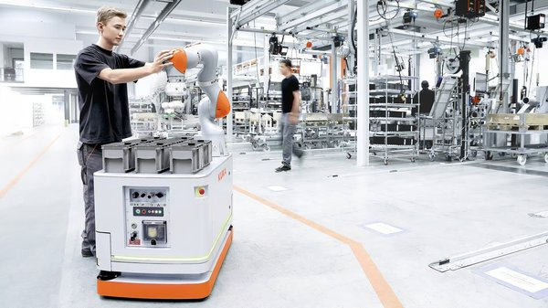
</p>

Modified version of the KUKA LWR4 (7 DOF) with an added **prismatic joint** between the last revolute joint and the end-effector, giving it **8 degrees of freedom**. The prismatic joint has a range of 0 to 0.08 m.

Everything runs on **ROS Noetic** with visualization in **RViz**. The robot model is defined via URDF/Xacro.

<p align="center">
  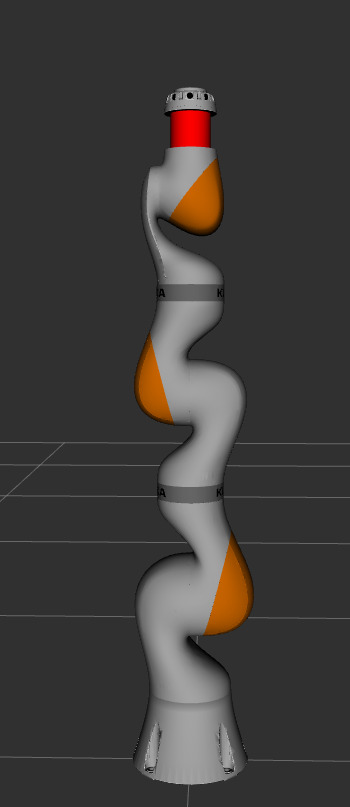
  &nbsp;&nbsp;&nbsp;
  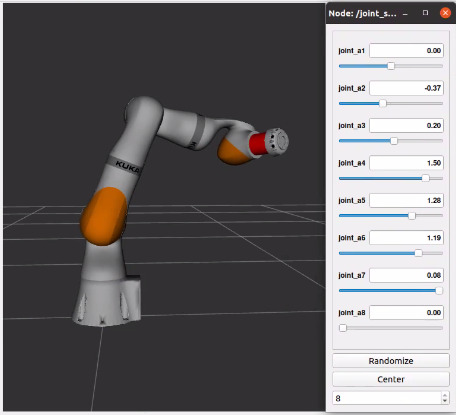
</p>

---

## What's in this repo

- URDF/Xacro description of the modified robot (8 DOF)
- Forward kinematics (DH parameters)
- Inverse kinematics (Newton-Raphson, numerical)
- Kinematic control (Jacobian-based, position control)
- Dynamics (inertia matrix, Coriolis, gravity via RBDL)
- Two dynamic controllers:
  - **Inverse dynamics** (feedback linearization) — settles in ~37s
  - **PD + gravity compensation** — settles in ~170s

---

## DH Parameters

| Joint | d (m) | θ (rad) | a (m) | α (rad) |
|:-----:|:-----:|:-------:|:-----:|:-------:|
| 1 | 0.36 | q₁ + π | 0 | π/2 |
| 2 | 0 | q₂ + π | 0 | π/2 |
| 3 | 0.42 | q₃ | 0 | π/2 |
| 4 | 0 | q₄ + π | 0 | π/2 |
| 5 | 0.40 | q₅ | 0 | π/2 |
| 6 | 0 | q₆ + π | 0 | π/2 |
| 7 (prismatic) | q₇ | 0 | 0 | 0 |
| 8 | 0.10 | q₈ | 0 | π/2 |

---

## Forward Kinematics

Computed from the DH table above. Reference frames verified in RViz:

<p align="center">
  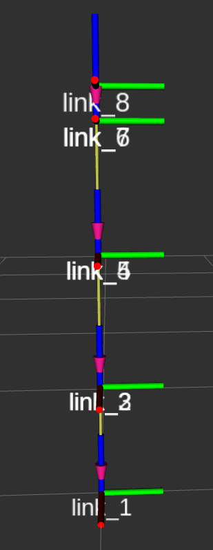
  &nbsp;&nbsp;&nbsp;
  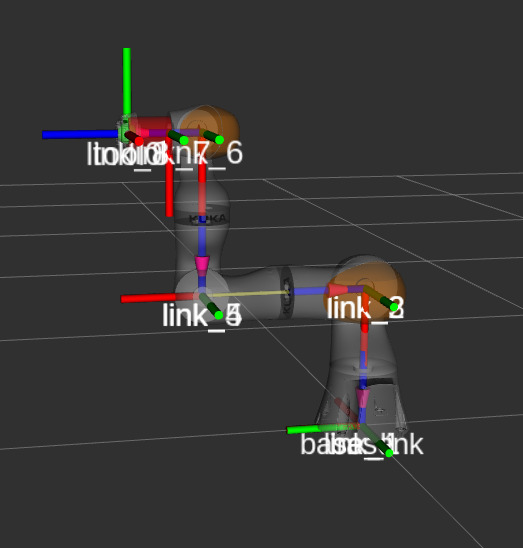
  &nbsp;&nbsp;&nbsp;
  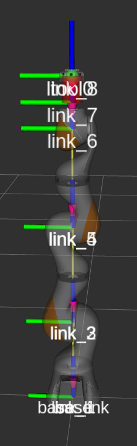
</p>

Example — `q = [0, 0, 0, 0, 0, 0, 0, 0]`:

<p align="center">
  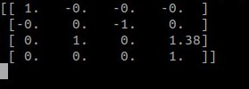
</p>

Position: `[0, 0, 1.38]` — the robot is fully extended upward, which matches the sum of link lengths.

---

## Inverse Kinematics

Numerical solution using Newton-Raphson. The method iterates until the FK output matches the desired position within a tolerance.

For `x_d = [0.5, 0.5, 0.5]` it converges in 42 iterations:

<p align="center">
  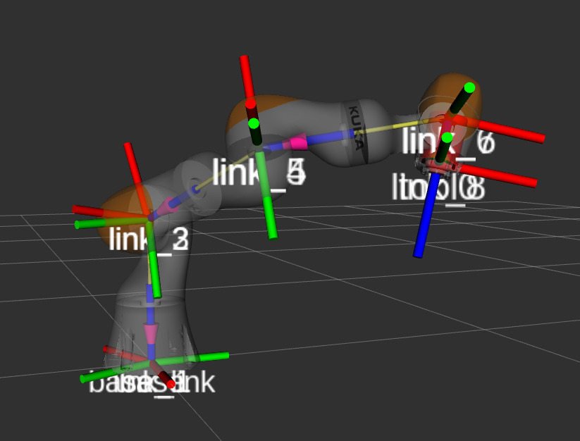
</p>

<p align="center">
  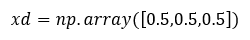
</p>

---

## Kinematic Control

Position control using the analytical Jacobian (3×8) and its pseudo-inverse. The prismatic joint (q₇) is clamped in the code since RViz doesn't enforce URDF limits during control.

The controller uses `ė* = -k·e` with `k = 1`, integrated via Euler method.

Target: `x_d = [0.5, 0.5, 0.5]` m

<p align="center">
  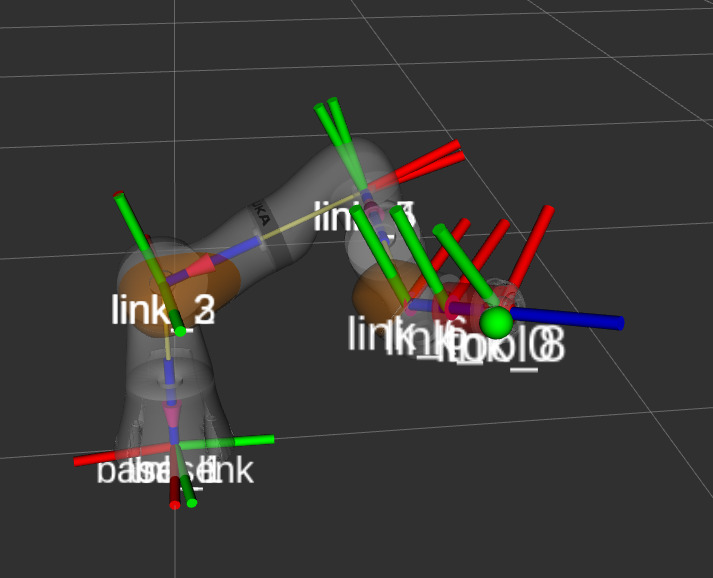
  <br>
  <em>End-effector reaching the target (green marker)</em>
</p>

Joint trajectories:

<p align="center">
  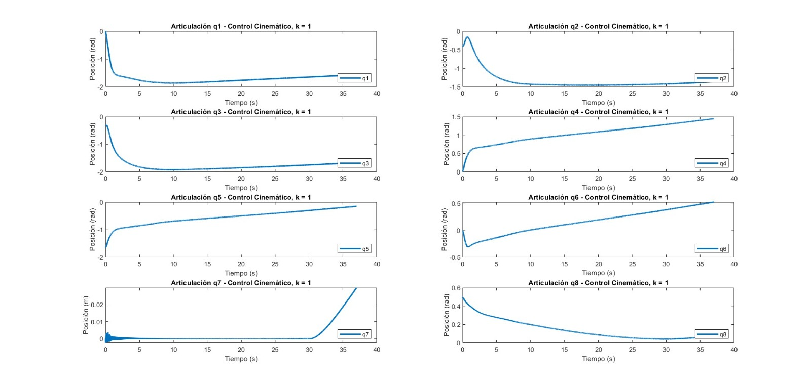
</p>

End-effector convergence in X, Y, Z:

<p align="center">
  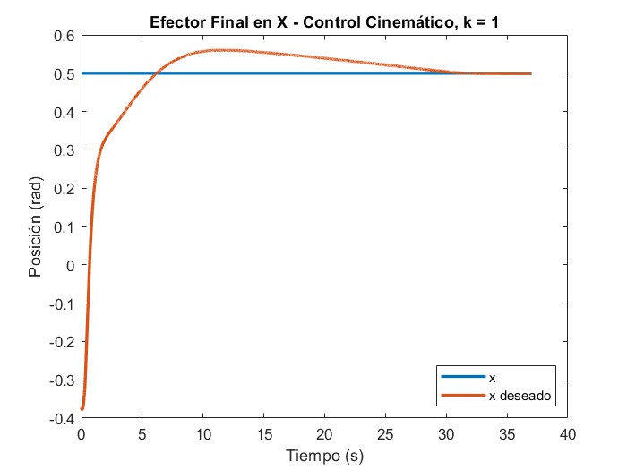
  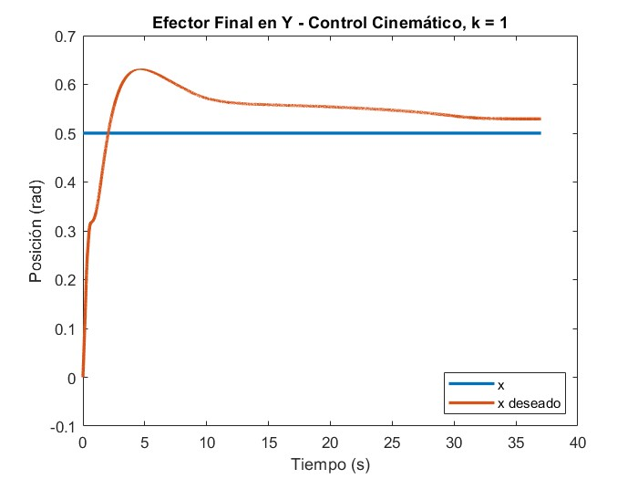
</p>
<p align="center">
  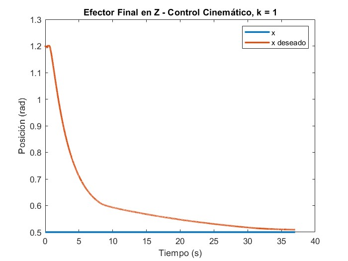
</p>

X and Z converge well. Y has a small steady-state offset — could be improved with higher gain or a different control strategy.

---

## Dynamic Control

Robot dynamics computed with **RBDL** from the URDF: inertia matrix M(q), Coriolis C(q,q̇)q̇, and gravity g(q).

### Inverse Dynamics Controller

Full model compensation:

```
u = M(q)(q̈_d + Kd(q̇_d − q̇) + Kp(q_d − q)) + C(q,q̇)q̇ + g(q)
```

Settles in about **37 seconds**:

<p align="center">
  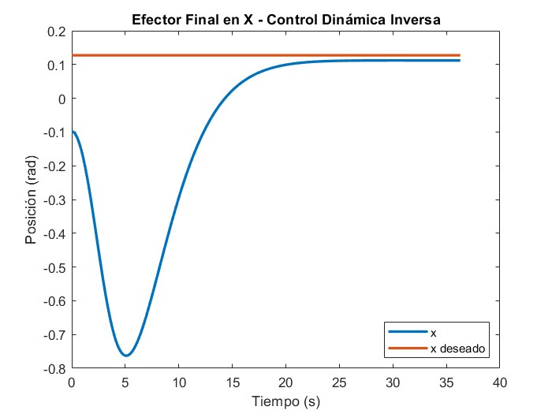
  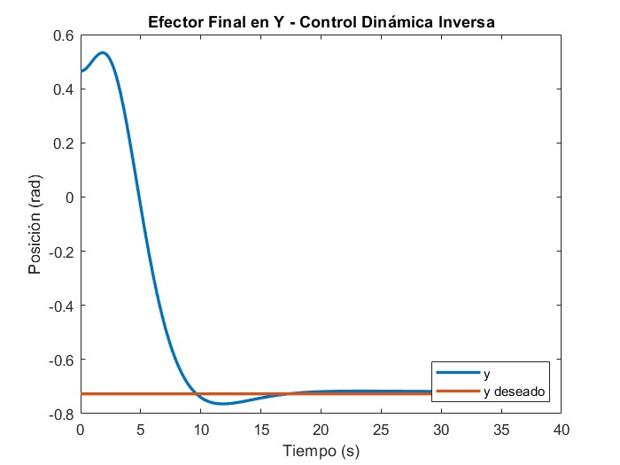
</p>
<p align="center">
  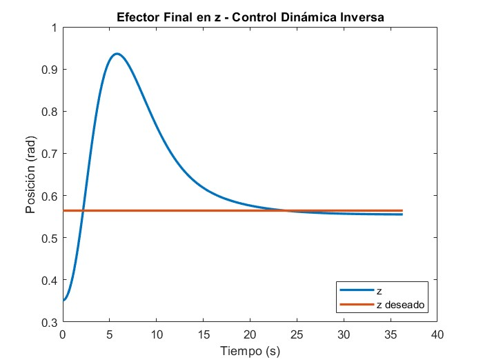
</p>

### PD + Gravity Compensation

Simpler controller — only compensates gravity:

```
u = g(q) + Kp(q_d − q) − Kd·q̇
```

Settles in about **170 seconds** (much slower, but simpler to implement):

<p align="center">
  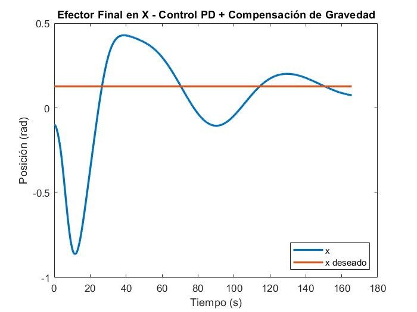
  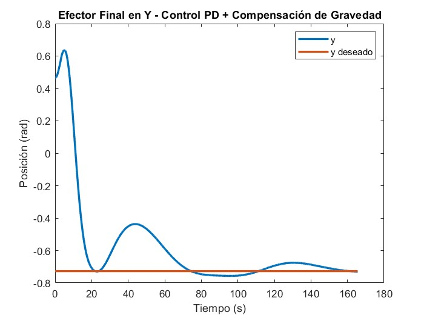
</p>
<p align="center">
  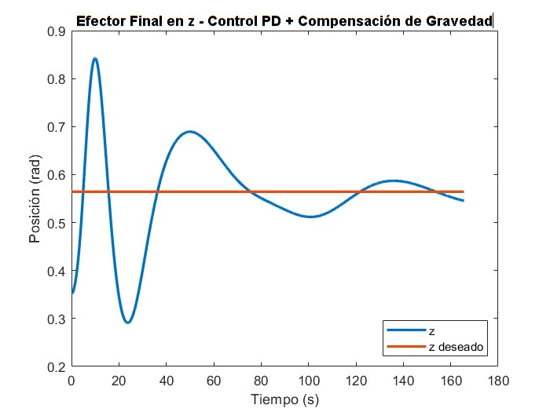
</p>

The inverse dynamics controller is roughly **4.5x faster** since it compensates the full nonlinear dynamics, not just gravity.

---

## How to run

Requirements: ROS Noetic, Python 3, RBDL, NumPy

```bash
# Clone
git clone https://github.com/josue99999/CONTROL-LWR-4-ROS-NOETIC.git

# Build
cd ~/catkin_ws && catkin_make

# Launch robot in RViz
roslaunch kuka_lbr_iiwa_support display.launch

# Forward kinematics test
rosrun kuka_lbr_iiwa_support test_fkine

# Inverse kinematics
rosrun kuka_lbr_iiwa_support test_ikine_PROYECTO

# Kinematic control
rosrun kuka_lbr_iiwa_support control_cinematico

# Dynamic control — inverse dynamics
rosrun kuka_lbr_iiwa_support control_dinamico_inverso

# Dynamic control — PD + gravity
rosrun kuka_lbr_iiwa_support control_pd_gravedad
```

---

## Notes

- The prismatic joint (q₇) starts at its max distance (0.08 m). In dynamic control, if the desired position exceeds this limit, q₇ stays at its physical boundary — this is expected behavior, not a bug.
- Kinematic control only handles position (not orientation) to keep things simpler.
- The Jacobian uses Moore-Penrose pseudo-inverse with a damping factor (λ = 0.01) near singularities.

---

## References

- Zaplana, I. (2017). *Análisis Cinemático de Robots Manipuladores Redundantes*
- Corrales, J. (2016). *Manipulation and path planning for KUKA (LWR/LBR 4+) robot*
- KUKA Robotics — [LBR iiwa](https://www.kuka.com/en-us/products/robotics-systems/industrial-robots/lbr-iiwa)
