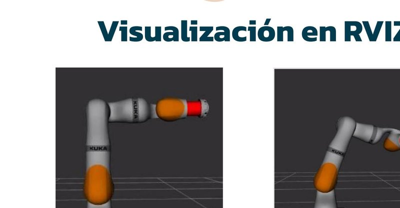
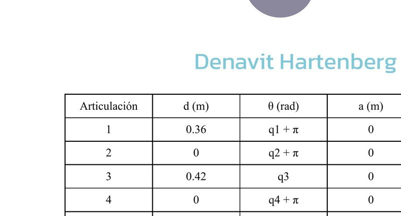
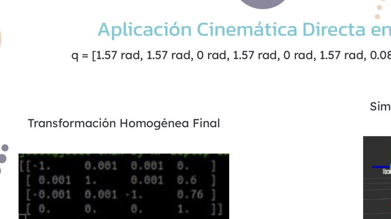
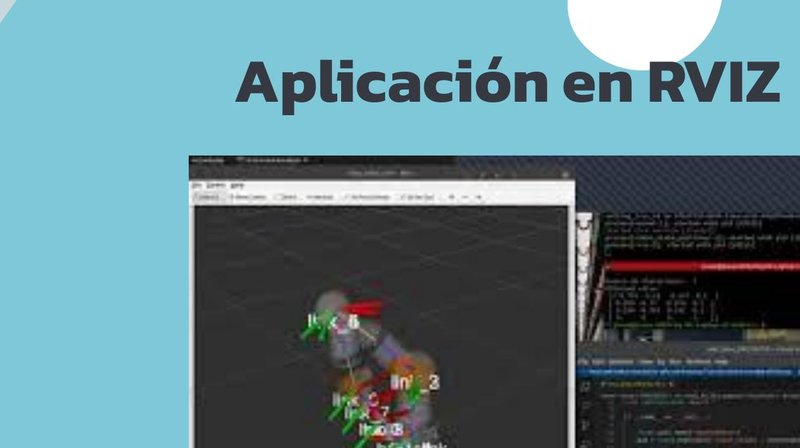
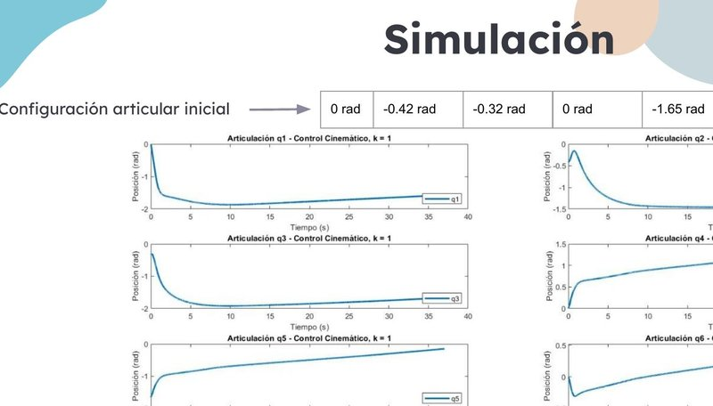
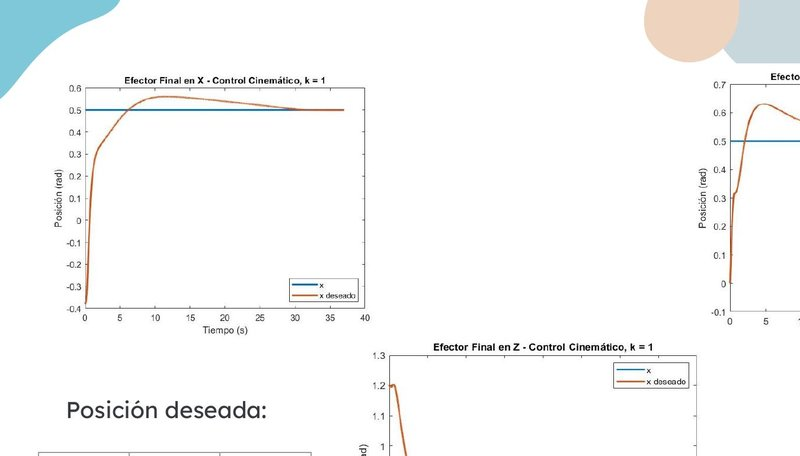
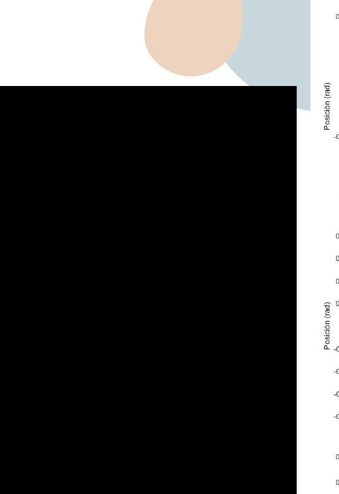

# KUKA LWR4 Modified — Kinematic & Dynamic Control in ROS Noetic

<p align="center">
  
</p>

Modeling, kinematic analysis, and dynamic control of a **modified KUKA LWR4** robotic arm (8 DOF) for automotive assembly tasks, fully simulated in **ROS Noetic + RViz**.

The original 7-DOF KUKA LWR4 was extended with an additional **prismatic joint** (0–0.08 m range) to increase workspace reach and precision for component fastening operations.

---

## Overview

| | |
|---|---|
| **Robot** | KUKA LWR4 + prismatic joint (8 DOF) |
| **Framework** | ROS Noetic, RViz |
| **Language** | Python 3 |
| **Libraries** | NumPy, RBDL (Rigid Body Dynamics), rospy |
| **Modeling** | URDF / Xacro |
| **Application** | Screw-fastening in automotive assembly |

---

## Robot Model

The modified robot ("KUKO") adds a prismatic joint between the 6th revolute joint and the end-effector, resulting in an 8-DOF serial manipulator with 7 revolute + 1 prismatic joints.

<p align="center">
  
  <br>
  <em>Modified KUKA LWR4 model in RViz — prismatic joint shown in red</em>
</p>

### Denavit-Hartenberg Parameters

<p align="center">
  
</p>

| Joint | d (m) | θ (rad) | a (m) | α (rad) |
|:-----:|:-----:|:-------:|:-----:|:-------:|
| 1 | 0.36 | q₁ + π | 0 | π/2 |
| 2 | 0 | q₂ + π | 0 | π/2 |
| 3 | 0.42 | q₃ | 0 | π/2 |
| 4 | 0 | q₄ + π | 0 | π/2 |
| 5 | 0.40 | q₅ | 0 | π/2 |
| 6 | 0 | q₆ + π | 0 | π/2 |
| 7 | q₇ | 0 | 0 | 0 |
| 8 | 0.10 | q₈ | 0 | π/2 |

---

## Forward Kinematics

Forward kinematics computed via homogeneous transformation matrices from DH parameters. Verified against RViz for multiple joint configurations.

<p align="center">
  
  <br>
  <em>FK verification — q = [1.57, 1.57, 0, 1.57, 0, 1.57, 0.08, 1.57] rad</em>
</p>

---

## Inverse Kinematics

Numerical approach using **Newton-Raphson method** — iteratively minimizes the error between the desired end-effector position and the current FK output.

<p align="center">
  
  <br>
  <em>IK solution for x_d = [0.5, 0.5, 0.5] m — converged in 42 iterations</em>
</p>

---

## Kinematic Control

Position-only kinematic control using the **analytical Jacobian** and pseudo-inverse with Moore-Penrose regularization to handle singularities. Prismatic joint limits enforced in code.

```
e = x - x_d
ė* = -k·e
q̇ = J⁺ · ė*
q_k = q_{k-1} + Δt · q̇_k
```

<p align="center">
  
  <br>
  <em>Joint trajectories — Kinematic control (k = 1)</em>
</p>

<p align="center">
  
  <br>
  <em>End-effector position convergence to [0.5, 0.5, 0.5] m</em>
</p>

---

## Dynamics

Robot dynamics computed using **RBDL** (Rigid Body Dynamics Library) from the URDF model:

- **Inertia matrix** M(q) — via Composite Rigid Body Algorithm
- **Coriolis vector** C(q, q̇)q̇
- **Gravity vector** g(q)
- **Torque**: τ = M(q)q̈ + C(q, q̇)q̇ + g(q)

---

## Dynamic Control

Two controllers were implemented and compared:

### 1. Inverse Dynamics Control (Feedback Linearization)

```
u = M(q)(q̈_d + K_d(q̇_d − q̇) + K_p(q_d − q)) + C(q,q̇)q̇ + g(q)
```

Stabilization time: **~37 seconds**

<p align="center">
  
  <br>
  <em>Inverse dynamics — end-effector convergence (X, Y, Z)</em>
</p>

### 2. PD + Gravity Compensation

```
u = g(q) + K_p(q_d − q) − K_d · q̇
```

Stabilization time: **~170 seconds**

<p align="center">
  
  <br>
  <em>PD + gravity compensation — end-effector convergence (X, Y, Z)</em>
</p>

> **Result:** Inverse dynamics control converges **4.6x faster** than PD + gravity compensation due to full dynamic model compensation.

---

## Tech Stack

- **ROS Noetic** — middleware, message passing, joint state publisher
- **RViz** — 3D visualization and simulation
- **URDF / Xacro** — robot description files
- **Python 3** — kinematics, control loops
- **RBDL** — rigid body dynamics computation
- **NumPy** — matrix operations, Jacobian, pseudo-inverse
- **Matplotlib** — result plotting

---

## How to Run

```bash
# Clone the repository
git clone https://github.com/josue99999/CONTROL-LWR-4-ROS-NOETIC.git

# Build the workspace
cd ~/catkin_ws && catkin_make

# Launch the robot in RViz
roslaunch kuka_lbr_iiwa_support display.launch

# Run forward kinematics test
rosrun kuka_lbr_iiwa_support test_fkine

# Run inverse kinematics
rosrun kuka_lbr_iiwa_support test_ikine_PROYECTO

# Run kinematic control
rosrun kuka_lbr_iiwa_support control_cinematico

# Run dynamic control (inverse dynamics)
rosrun kuka_lbr_iiwa_support control_dinamico_inverso

# Run PD + gravity compensation
rosrun kuka_lbr_iiwa_support control_pd_gravedad
```

---

## Project Structure

```
├── urdf/                    # URDF and Xacro robot description
├── meshes/                  # 3D mesh files for each link
├── launch/                  # ROS launch files
├── scripts/
│   ├── test_fkine           # Forward kinematics verification
│   ├── test_ikine_PROYECTO  # Inverse kinematics (Newton-Raphson)
│   ├── control_cinematico   # Kinematic control (Jacobian-based)
│   ├── control_dinamico_inverso  # Inverse dynamics controller
│   └── control_pd_gravedad  # PD + gravity compensation
├── config/                  # RViz configuration
└── README.md
```

---

## Key Results

| Metric | Kinematic Control | Inverse Dynamics | PD + Gravity |
|--------|:-:|:-:|:-:|
| Settling time | ~40s | ~37s | ~170s |
| Steady-state error | Low (X,Z) / Moderate (Y) | Low | Low |
| Overshoot | Minimal | Moderate | High |
| Model complexity | Jacobian only | Full dynamics | Gravity only |

---

## References

1. Zaplana, I. (2017). *Análisis Cinemático de Robots Manipuladores Redundantes*
2. Corrales, J. (2016). *Manipulation and path planning for KUKA (LWR/LBR 4+) robot*
3. KUKA Robotics — [LBR iiwa Documentation](https://www.kuka.com/en-us/products/robotics-systems/industrial-robots/lbr-iiwa)

---

## Author

**Josué Abad Chate** — Robotics Engineering, UTEC (2023)
